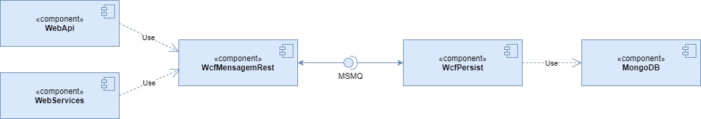

# Trabalho final .NET: comunicação entre várias camadas com MSMQ e Mongo

PUC Minas - Pós graduação em Arquitetura de Sistemas Distribuídos

Disciplina de Arquitetura de Software na Plataforma .Net

## Aluno

- Daniel Saraiva

## Descrição

Trabalho final para disciplina de Arquitetura de Software na Plataforma .Net. Foi criada uma solução
multicamadas que aceita entrada via dois webservices implementados em *WebApi* e *ASMX*, mandam a mensagem
para um *Wcf Rest* intermediário via HTTP POST. A mensagem é então gravada em uma fila do MSMQ.

Posteriormente a mensagem é lida por outro WCF que aceita entrada da fila via binding, finalmente
persistindo a mensagem em um banco MongoDB.

## Diagrama de componentes

## Ajustes e observações para execução local

- Alterar o nome da fila de mensagens no MSMQ, se desejado. Está como `trabalhofinal`. A fila será criada automaticamente caso não exista.
- Editar a string de conexão para o MongoDB em `WcfPersist\Persist\Mongo.cs` (a string de conexão atual no código não funciona)
- A solução está configurada para executar os webservices utilizando IIS Express nas portas 8001, 8002 e 8003

## Endpoints para teste

### WebApi

- Endpoint: `http://localhost:8002/webapi/api/mensagem`
- Método: `POST`
- Corpo da requisição: `{"mensagem": "teste"}`
- Tipo do conteúdo: `application/json`

### WebServices

- Endpoint: `http://localhost:8003/Mensagem.asmx/Salvar`
- Método: `POST`
- Corpo da requisição: `mensagem=teste`
- Tipo do conteúdo: `x-www-form-urlencoded`

### WcfMensagemRest

Este webservice não é destinado a acesso direto - ele é acessado pelo WebApi e WebServices.

- Endpoint: `http://localhost:8001/WcfMensagemRest.svc/SalvarMensagem`
- Método: `POST`
- Corpo da requisição: `{"mensagem": "teste"}`
- Tipo do conteúdo: `application/json`

